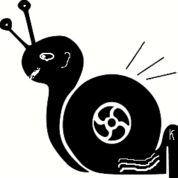

# ioBroker.watchsnail

**Tests:** 

## **watchsnail** adapter for ioBroker
Status report notification (battery, reachable, error etc)

### Keywords
status battery error report notification reachable abnormalities

## **Disclaimer**
I hereby exclude liability for any damage and consequential damage that may arise from testing or using the software.
The software is designed for pure hardware-related communication.
Safety-relevant protective mechanisms are to be implemented independently in their environment

## Changelog
[Changelog](CHANGELOG.md)

## License
GPL-3.0-only

## Copyright
Copyright (c) 2022 kbrausew <kbrausew@magenta.de>